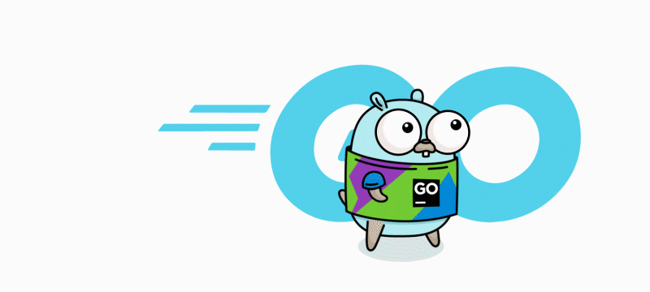
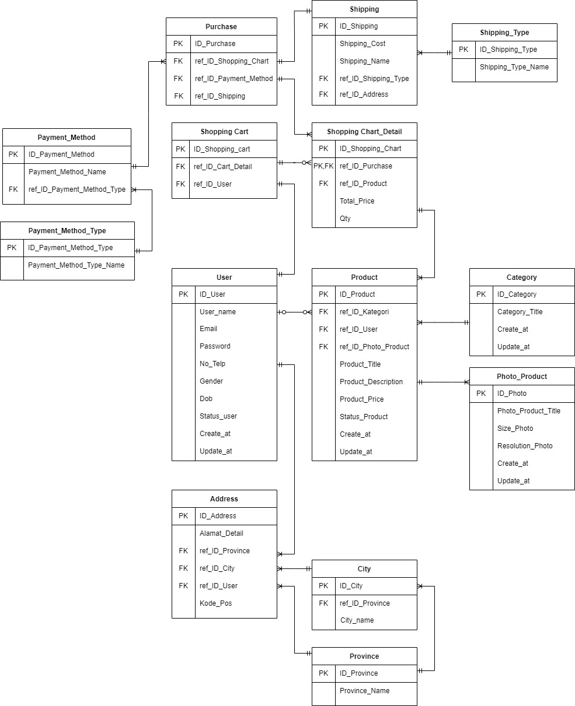

<!-- PROJECT LOGO -->
 

  

  <h3 align="center">Project#1 "Alta-Shop" E-Commerce </h3>

  

    Projek Pertama Pembangunan RESTful API Program Immersive Back End Batch 4
     
    <a href="https://github.com/alfiancikoa/alta-gproject-restful-api"><strong>Kunjungi kami »</strong></a>
     
  

### 🛠 &nbsp;Build App & Database

&nbsp;
&nbsp;
&nbsp;
&nbsp;
&nbsp;
&nbsp;
&nbsp;

<!-- ABOUT THE PROJECT -->
### 💻 &nbsp;About The Project

Alta-Shop merupakan projek pertama kami untuk membangun sebuah RESTful API E-commerce dengan menggunakan bahasa Golang.    
dilengkapi dengan berbagai fitur yang memungkinkan user untuk mengakses data yang ada didalam server. Adapun fitur yang ada dalam RESTful API kami antara lain :

      

🙎 Users

  
  <!---
  | Command | Description |
| --- | --- |
  --->
  
 Di User terdapat fitur untuk membuat Akun dan Login agar mendapat legalitas untuk mengakses berbagai fitur lain di aplikasi, 
 terdapat juga fitur Update untuk mengedit data yang berkaitan dengan user, serta fitur delete berfungsi jika user menginginkan hapus akun.
 

  
| Feature User | Format JSON |
| --- | --- |
| [e.POST("/users", user.CreateUserController)](https://github.com/alfiancikoa/alta-gproject-restful-api/blob/main/controllers/user/user.go) |  |
| [e.POST("/login", user.LoginUsersController)](https://github.com/alfiancikoa/alta-gproject-restful-api/blob/main/controllers/user/user.go) |  |
| [eJWT.GET("/users/:id", user.GetUserByIdController)](https://github.com/alfiancikoa/alta-gproject-restful-api/blob/main/controllers/user/user.go) |  |
| [eJWT.PUT("/users/:id", user.UpdateUserController)](https://github.com/alfiancikoa/alta-gproject-restful-api/blob/main/controllers/user/user.go) |  |
| [eJWT.DELETE("/users/:id", user.DeleteUserController)](https://github.com/alfiancikoa/alta-gproject-restful-api/blob/main/controllers/user/user.go) |  |

  

🏷&nbsp;Category

  
  <!---
  | Command | Description |
| --- | --- |
  --->
  
  Category berfungsi untuk mengelompokkan berbagai product agar user lebih mudah mencari barang yang dibutuhkan, terdapat fitur Insert untuk membuat category product,
  dan GET merupakan fitur untuk user mendapatkan product sesuai Category.
  
| Feature Category | Format JSON |
| --- | --- |
| [e.POST("/products/category", category.InsertCategoryController)](https://github.com/alfiancikoa/alta-gproject-restful-api/blob/main/controllers/category/category.go) | |
| [e.GET("/products/category", category.GetAllCategorysController)](https://github.com/alfiancikoa/alta-gproject-restful-api/blob/main/controllers/category/category.go) | |

📦&nbsp;Products

  
  <!---
  | Command | Description |
| --- | --- |
  --->
  
| Feature Products | Format JSON |
| --- | --- |
| [e.GET("/products", product.GetAllProductsController)](https://github.com/alfiancikoa/alta-gproject-restful-api/blob/main/controllers/product/product.go) | |
| [eJWT.GET("/products/:id", product.GetProductController)](https://github.com/alfiancikoa/alta-gproject-restful-api/blob/main/controllers/product/product.go) | |
| [eJWT.GET("/products/my", product.GetMyProductController)](https://github.com/alfiancikoa/alta-gproject-restful-api/blob/main/controllers/product/product.go) | |
| [eJWT.POST("/products", product.CreateProductsController)](https://github.com/alfiancikoa/alta-gproject-restful-api/blob/main/controllers/product/product.go) | |
| [eJWT.DELETE("/products/:id", product.DeleteProductController)](https://github.com/alfiancikoa/alta-gproject-restful-api/blob/main/controllers/product/product.go) | |
| [eJWT.PUT("/products/:id", product.UpdateProductController)](https://github.com/alfiancikoa/alta-gproject-restful-api/blob/main/controllers/product/product.go) | |

🛒&nbsp;Cart

  
  <!---
  | Command | Description |
| --- | --- |
  --->
  
| Feature Cart | Format JSON |
| --- | --- |
| [eJWT.POST("/carts", cart.CreateCartController)](https://github.com/alfiancikoa/alta-gproject-restful-api/blob/main/controllers/cart/cart.go) | |
| [eJWT.GET("/carts/my", cart.GetCartController)](https://github.com/alfiancikoa/alta-gproject-restful-api/blob/main/controllers/cart/cart.go) | |
| [eJWT.PUT("/carts/:id", cart.UpdateCartController)](https://github.com/alfiancikoa/alta-gproject-restful-api/blob/main/controllers/cart/cart.go) | |
| [eJWT.DELETE("/carts/:id", cart.DeleteCartController)](https://github.com/alfiancikoa/alta-gproject-restful-api/blob/main/controllers/cart/cart.go) | |

💳&nbsp;Order

  
  <!---
  | Command | Description |
| --- | --- |
  --->
  
| Feature Order | Format JSON |
| --- | --- |
| [eJWT.POST("/orders", order.CreateNewOrderController))](https://github.com/alfiancikoa/alta-gproject-restful-api/blob/main/controllers/order/order.go) | |
| [eJWT.GET("/orders", order.GetOrderController))](https://github.com/alfiancikoa/alta-gproject-restful-api/blob/main/controllers/order/order.go) | |

      

<!-- ERD -->
### ERD

<!-- CONTACT -->
### Contact

:copyright: 2021 | ANS

</h3>
